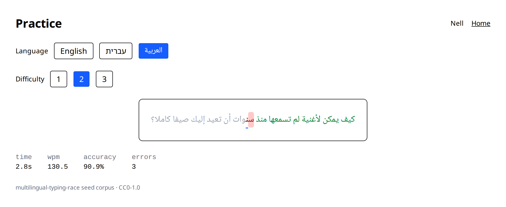
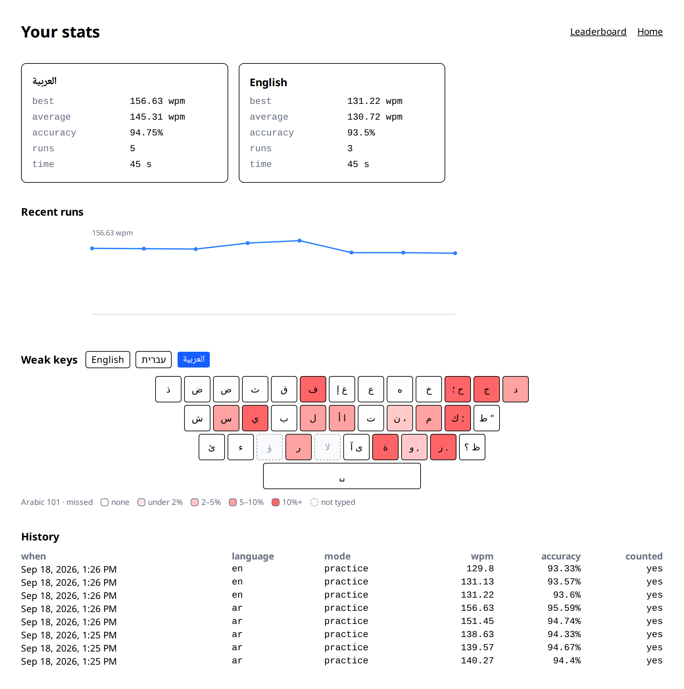

# Multilingual Typing Race

A TypeRacer-style typing trainer for **Hebrew, Arabic and English**: practice alone or race friends in real time, track WPM / accuracy / weak keys over time, leaderboards per language, daily challenge.

**Live:** [web-production-1f908.up.railway.app](https://web-production-1f908.up.railway.app) · API health: [`/healthz`](https://api-production-57dab.up.railway.app/healthz)

> Status: **M5 complete.** Working today: practice in Hebrew, Arabic or English; race up to four friends (five players to a room) in real time over WebSockets; a daily challenge that is the same text for everyone; and per-language stats — speed, accuracy, history, a keyboard heatmap of the keys you miss, and daily / weekly / all-time leaderboards. Every run is scored and validated server-side from the raw keystroke log. The interface itself is English-only for now (ADR-017); see [Planned](#planned).

## How scoring works

The browser sends only the keystroke log — `[t_ms, expected, typed]` per key, `"\b"` for backspace — never a number. The server replays it and computes:

| metric   | formula                                        |
|----------|------------------------------------------------|
| WPM      | (correct characters ÷ 5) ÷ minutes             |
| raw WPM  | (all typed characters ÷ 5) ÷ minutes           |
| CPM      | correct characters ÷ minutes                   |
| accuracy | correct ÷ (correct + errors) × 100             |

The same formulas apply to all three languages. A session is stored as invalid — kept for inspection, excluded from stats and leaderboards — if the log is empty, if it holds fewer keystrokes than the text has characters, if replaying it doesn't reproduce the target text, if timestamps go backwards, if the median gap between keys is under 30 ms (checked once there are at least 20 gaps to take a median of), if 10 or more keys arrive ≤ 5 ms apart, or, in a race, if the client's duration disagrees with the server's clock by more than 1.5 s. A valid run above 250 WPM is kept and flagged for review rather than rejected. See `backend/app/services/validator.py`.

## Hebrew and Arabic

What you see is what you type: every text is normalized once at import (niqqud and tashkeel stripped, typographic punctuation mapped to the keys on the SI-1452 / Arabic 101 layouts, letters matched strictly — ך ≠ כ, أ ≠ ا) and the same string is displayed and validated. The typing box renders one span per character in all three languages; browsers keep Arabic letters joined across spans as long as the font is identical, which we measured before deciding not to build a second renderer. Details, rules and the reasoning: [docs/rtl-notes.md](docs/rtl-notes.md).

## What it looks like

Practising in Arabic, mid-run. Green is behind the caret, the pink cell is a character typed wrong — and the letters stay joined across it, because the renderer is one `<span>` per character and the shaping is the browser's job (ADR-014). Speed, accuracy and errors update as you type; the numbers that count are the server's.



The stats page: best and average per language, the last runs as a trend, and the keys you miss on the layout you actually type on — here Arabic 101. A key with no data is dashed rather than coloured, so "never typed" cannot be read as "never missed".



## Accounts

Email and password (argon2), a short-lived access token held in memory and a rotating refresh token in an httpOnly cookie: using a refresh token spends it, so a stolen one stops working the moment the real user refreshes. Registration, login and refresh are rate-limited in Redis — per client address, plus a counter of failed logins per email address that any successful login clears. Ceilings are environment settings, not constants. See [ADR-009](docs/DECISIONS.md) and [ADR-022](docs/DECISIONS.md).

## Stack

- **Backend:** Python 3.13, FastAPI, SQLAlchemy 2.0 (async) + asyncpg, Alembic, PostgreSQL 16, Redis 7
- **Frontend:** React 19, TypeScript, Vite, Tailwind CSS, TanStack Query, Zustand, self-hosted Noto fonts
- **Infra:** Docker Compose (dev), GitHub Actions (CI), Railway (hosting)

## Run locally

```bash
cp .env.example .env
docker compose -f infra/docker-compose.yml up --build
```

- Frontend: http://localhost:5173
- API: http://localhost:8000 — health at `GET /healthz`, docs at `/docs`
- Seed the corpus once: `docker compose -f infra/docker-compose.yml exec api python -m app.cli seed-texts`

Backend checks (needs Python 3.13):

```bash
cd backend && python -m venv .venv && source .venv/bin/activate
pip install -e ".[dev]"
ruff format --check . && ruff check . && mypy . && python -m pytest -q
```

Frontend checks (needs Node 24):

```bash
cd frontend && npm install
npm run lint && npm run typecheck && npm test && npm run build
```

## Repo layout

```
backend/
  app/api/        HTTP routes (health, auth, texts, admin, sessions, stats, leaderboards + daily)
                  and the room WebSocket
  app/core/       settings, security, errors, dependencies, pagination
  app/i18n/       normalize.py — the he/ar/en normalization rules
  app/models/     SQLAlchemy models; alembic/ holds the migrations
  app/seeds/      the CC0 corpus: en.py, he.py, ar.py
  app/services/   users, texts, typing_metrics, validator, sessions, rooms (Redis + pub/sub), stats
  tests/          pytest, one file per module; runs against a real Postgres
frontend/
  src/features/typing-engine/   pure reducer + TypingBox renderer
  src/features/practice/        practice page, results card
  src/features/race/            room reducer, socket, lobby/race/results pages
  src/features/stats/           stats, leaderboards, keyboard heatmap + layouts
  src/features/auth/            auth store and forms
  src/i18n/                     language table (labels, direction)
  src/lib/                      api.ts (typed API client), queries.ts (shared query definitions)
infra/          docker-compose.yml
docs/           DECISIONS.md (ADRs), rtl-notes.md, race-protocol.md
.github/        CI workflow (backend + frontend jobs)
```

## Planned

Not built yet. Everything above this section describes what is in the repo today.

- **M6 — the visual pass.** The current interface is deliberately plain: correct behaviour, default styling. M6 is the design of every page, dark mode included.
- **Interface translations.** Hebrew and Arabic labels with a mirrored layout, deferred to M6 so the strings are translated once against the final UI (ADR-017). The text language and the interface language stay independent: a Hebrew speaker can practise English typing in a Hebrew interface.

## Docs

- [Decision log](docs/DECISIONS.md) — every architectural choice, with its reasoning
- [RTL notes](docs/rtl-notes.md) — how Hebrew and Arabic are normalized, rendered and validated
- [Race protocol](docs/race-protocol.md) — rooms, WebSocket messages, timing, disconnects, scoring

## License

[MIT](LICENSE). The seed sentences are original and released under CC0.
