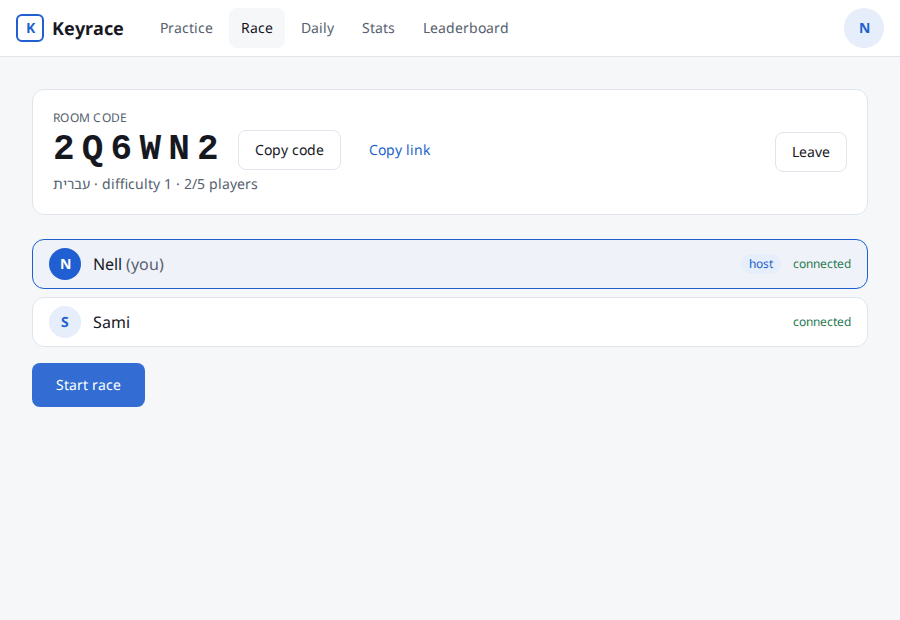
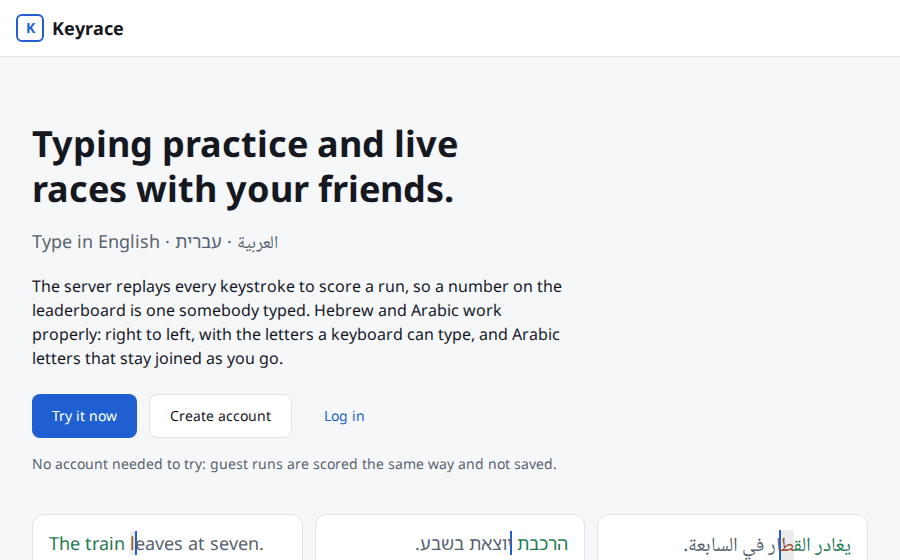
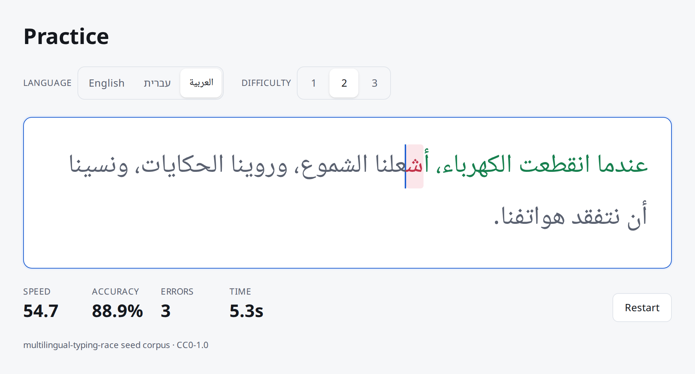
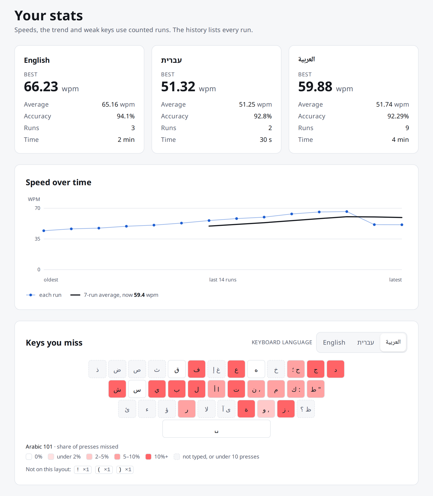
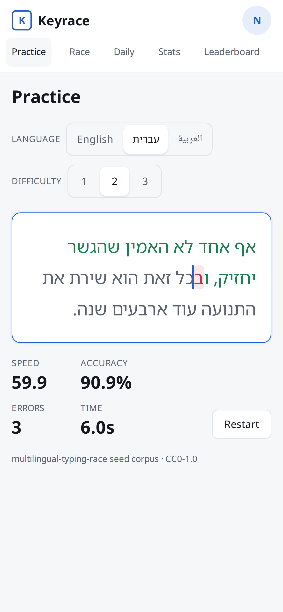
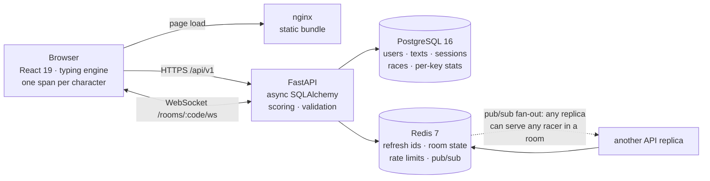
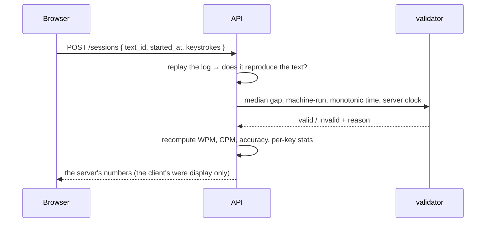

# Keyrace

**Type in English · עברית · العربية**

[](https://github.com/Nell-Kh/multilingual-typing-race/actions/workflows/ci.yml)
[](LICENSE)
[](https://github.com/Nell-Kh/multilingual-typing-race/releases/latest)

**[Live](https://web-production-1f908.up.railway.app)** · **[Try it without an account](https://web-production-1f908.up.railway.app/try)** · [API health](https://api-production-57dab.up.railway.app/healthz) · [Docs](#docs)



<sub>Recorded from the host's screen. The typing is scripted by Playwright at a human pace (150 ms and 205 ms per key); the countdown, relay, validation and results are the real stack.</sub>

## What it is

A real-time typing trainer and race for Hebrew, Arabic and English. The browser sends only the raw keystroke log; the server replays every keystroke, computes every score and decides whether a run counts. Hebrew and Arabic are handled properly: texts are normalized to what a keyboard can type, and Arabic letters keep their joined shapes as you type.

## Features

- **Practice** in any of the three languages at three difficulties — with an account, or as a guest whose runs are scored the same way and not saved.
- **Real-time races** of up to 5 players, joined by a room code: server countdown, live progress bars, places decided by the server.
- **Racing alone**: a pacer at 40, 60 or 80 WPM on any practice text, and on the daily, a ghost of today's #1 replayed from their key timings.
- **Daily challenge**: one text per language, the same for everyone, new at midnight Israel time, with its own board.
- **Stats** per language: best and average speed, accuracy, history, a speed chart with a 7-run average, and a heatmap of the keys you miss on your own keyboard layout.
- **Leaderboards** per language — all-time, weekly and daily — with tied speeds sharing a rank and your own row pinned when you are outside the top.
- **Light and dark mode**, following the system setting.
- **Works on a 360px phone**, right to left as well as left to right.

Status: **v1.0 — complete.**

## Engineering highlights

- **220 backend tests** (pytest against a real PostgreSQL and Redis) and **125 frontend tests** (Vitest + Testing Library).
- **5 end-to-end tests in 3 Playwright specs**, run in CI against the built frontend and a real API — including a whole race between two browsers, and a visitor trying it without an account.
- **The server is the judge**: seven validation rules on every log (empty, too few keystrokes, replay does not reproduce the text, time running backwards, median gap under 30 ms, 10+ keys at machine speed, and in a race a duration that disagrees with the server's clock by over 1.5 s), plus a review flag above 250 WPM.
- **Race state that survives restarts, double starts and second tabs**: rooms live in Redis, every transition is a Lua compare-and-set, and timed transitions are applied by whichever server next looks at the room ([ADR-031](docs/DECISIONS.md)).
- **Hebrew and Arabic by design**: import-time normalization of niqqud, tashkeel and typographic punctuation; one span per character with the browser keeping Arabic joined ([docs/rtl-notes.md](docs/rtl-notes.md)).
- **35 architecture decision records**, each with its context, decision and cost: [docs/DECISIONS.md](docs/DECISIONS.md).

## Screenshots

A visitor with no account: "Try it now" on the landing page, Arabic, the 60 WPM pacer, and the server's verdict at the end, not saved. The typing is scripted at a human pace.



Practising in Arabic, mid-run (typed by a script, with deliberate mistakes). Green is behind the caret; the red letter on a pink cell is the one typed wrong — the ش of أشعلنا — and it stays joined to the ع after it, because the renderer is one `<span>` per character and the shaping is the browser's job (ADR-014). A wrong letter is marked by background as well as colour (ADR-032).

<picture>
  <source media="(prefers-color-scheme: dark)" srcset="docs/img/practice-arabic-dark.png">
  
</picture>

The stats page, filled by scripted practice runs: best and average per language, every recent run with its 7-run moving average, and the keys you miss on Arabic 101. A key typed fewer than 10 times is dashed rather than coloured, so "barely typed" cannot be read as "never missed" (ADR-025).

<picture>
  <source media="(prefers-color-scheme: dark)" srcset="docs/img/stats-heatmap-dark.png">
  
</picture>

On a phone, right to left: Hebrew practice at 390px, one wrong letter on screen.

<picture>
  <source media="(prefers-color-scheme: dark)" srcset="docs/img/phone-hebrew-dark.png">
  
</picture>

<sub>GitHub shows the dark screenshots to readers whose system is in dark mode, the light ones otherwise.</sub>

## How scoring works

**The server is the judge.** The browser never sends a score. It sends the raw keystroke log — `[t_ms, expected, typed]` per key — and the server replays it, recomputes every number, and decides whether the run counts at all. A client that lies has to lie in a log that replays to the target text at a human rhythm.

The browser sends only the keystroke log — `[t_ms, expected, typed]` per key, `"\b"` for backspace — never a number. The server replays it and computes:

| metric   | formula                                        |
|----------|------------------------------------------------|
| WPM      | (correct characters ÷ 5) ÷ minutes             |
| raw WPM  | (all typed characters ÷ 5) ÷ minutes           |
| CPM      | correct characters ÷ minutes                   |
| accuracy | correct ÷ (correct + errors) × 100             |

The same formulas apply to all three languages. A session is stored as invalid — kept for inspection, excluded from stats and leaderboards — if the log is empty, if it holds fewer keystrokes than the text has characters, if replaying it doesn't reproduce the target text, if timestamps go backwards, if the median gap between keys is under 30 ms (checked once there are at least 20 gaps to take a median of), if 10 or more keys arrive ≤ 5 ms apart, or, in a race, if the client's duration disagrees with the server's clock by more than 1.5 s. A valid run above 250 WPM is kept and flagged for review rather than rejected. See `backend/app/services/validator.py`.

## Hebrew and Arabic

Typing trainers are built for Latin scripts, and the assumptions leak. Hebrew and Arabic arrive with vowel marks the keyboard cannot produce, with typographic punctuation that is not the punctuation on the key, and with letters that look the same to a reader and are different characters to a computer — ך and כ, أ and ا. Arabic letters change shape depending on their neighbours, so a renderer that draws one character at a time breaks the word. Every text here is normalized once at import so that what is displayed is exactly what a keyboard can produce, and the renderer keeps the shaping intact ([docs/rtl-notes.md](docs/rtl-notes.md)).

What you see is what you type: every text is normalized once at import (niqqud and tashkeel stripped, typographic punctuation mapped to the keys on the SI-1452 / Arabic 101 layouts, letters matched strictly — ך ≠ כ, أ ≠ ا) and the same string is displayed and validated. The typing box renders one span per character in all three languages; browsers keep Arabic letters joined across spans as long as the font is identical, which we measured before deciding not to build a second renderer. Details, rules and the reasoning: [docs/rtl-notes.md](docs/rtl-notes.md).

## How it fits together


```mermaid
flowchart LR
    B["Browser<br/>React 19 · typing engine<br/>one span per character"]
    W["nginx<br/>static bundle"]
    A["FastAPI<br/>async SQLAlchemy<br/>scoring · validation"]
    A2["another API replica"]
    P[("PostgreSQL 16<br/>users · texts · sessions<br/>races · per-key stats")]
    R[("Redis 7<br/>refresh ids · room state<br/>rate limits · pub/sub")]

    B -- "page load" --> W
    B -- "HTTPS /api/v1" --> A
    B <-- "WebSocket /rooms/:code/ws" --> A
    A --> P
    A --> R
    A2 --> R
    R -. "pub/sub fan-out: any replica<br/>can serve any racer in a room" .-> A2
```

A race is not held in one process. Room state is a Redis hash with a TTL, every change that could race — joining the last seat, starting, each timed transition — is a Lua compare-and-set, and every frame is published to a channel. The countdown and the race deadline are stored in the room and applied by whichever server next looks at it, so a redeploy mid-race costs the players a reconnect, not the race, and the players in a room can be spread across replicas. Details in [docs/race-protocol.md](docs/race-protocol.md); the reasoning in ADR-018 and ADR-031, including what is still not covered.


```mermaid
sequenceDiagram
    participant C as Browser
    participant S as API
    participant V as validator
    C->>S: POST /sessions { text_id, started_at, keystrokes }
    S->>S: replay the log → does it reproduce the text?
    S->>V: median gap, machine-run, monotonic time, server clock
    V-->>S: valid / invalid + reason
    S->>S: recompute WPM, CPM, accuracy, per-key stats
    S-->>C: the server's numbers (the client's were display only)
```

## Accounts

Email and password (argon2), a short-lived access token held in memory and a rotating refresh token in an httpOnly cookie: using a refresh token spends it, so a stolen one stops working the moment the real user refreshes. Registration, login and refresh are rate-limited in Redis — per client address, plus a counter of failed logins per email address that any successful login clears. Ceilings are environment settings, not constants. See [ADR-009](docs/DECISIONS.md) and [ADR-022](docs/DECISIONS.md).

**Keystroke logs are kept.** Each run's raw log — the time and character of every key — is stored for as long as the run exists, so any score can be replayed and checked again later. It is never returned by the API; the run's numbers are ([ADR-029](docs/DECISIONS.md)).

## Stack

- **Backend:** Python 3.13, FastAPI, SQLAlchemy 2.0 (async) + asyncpg, Alembic, PostgreSQL 16, Redis 7
- **Frontend:** React 19, TypeScript, Vite, Tailwind CSS, TanStack Query, Zustand, self-hosted Noto fonts
- **Infra:** Docker Compose (dev), GitHub Actions (CI), Railway (hosting)

## Run locally

```bash
cp .env.example .env
docker compose -f infra/docker-compose.yml up --build
```

- Frontend: http://localhost:5173
- API: http://localhost:8000 — health at `GET /healthz`, docs at `/docs`
- Seed the corpus once: `docker compose -f infra/docker-compose.yml exec api python -m app.cli seed-texts`

Backend checks (needs Python 3.13):

```bash
cd backend && python -m venv .venv && source .venv/bin/activate
pip install -e ".[dev]"
ruff format --check . && ruff check . && mypy . && python -m pytest -q
```

Frontend checks (needs Node 24):

```bash
cd frontend && npm install
npm run lint && npm run typecheck && npm test && npm run build
```

**220 backend tests** (pytest, against a real PostgreSQL and Redis), **125 frontend tests**
(Vitest + Testing Library) and **5 end-to-end tests** that boot the stack and drive the
built frontend with Playwright, one a whole race between two browsers and one a visitor trying it without an account. All three
suites run in CI on every pull request ([e2e/README.md](e2e/README.md)).

## Repo layout

The repository is named `multilingual-typing-race`; Keyrace is the product.

```
backend/
  app/api/        HTTP routes (health, auth, texts, admin, sessions, stats, leaderboards + daily)
                  and the room WebSocket
  app/core/       settings, security, errors, dependencies, pagination
  app/i18n/       normalize.py — the he/ar/en normalization rules
  app/models/     SQLAlchemy models; alembic/ holds the migrations
  app/seeds/      the CC0 corpus: en.py, he.py, ar.py
  app/services/   users, texts, typing_metrics, validator, sessions, rooms (Redis + pub/sub), stats
  tests/          pytest, one file per module; runs against a real Postgres
frontend/
  src/features/typing-engine/   pure reducer + TypingBox renderer
  src/features/practice/        practice page, results card
  src/features/race/            room reducer, socket, lobby/race/results pages
  src/features/stats/           stats, leaderboards, keyboard heatmap + layouts
  src/features/auth/            auth store and forms
  src/i18n/                     language table (labels, direction)
  src/lib/                      api.ts (typed API client), queries.ts (shared query definitions)
  src/ui/                       shared pieces: header, wordmark, button, segmented toggle, stat strip (ADR-032)
e2e/            Playwright: the smoke journey and a two-browser race, against the built frontend
infra/          docker-compose.yml
docs/           DECISIONS.md (ADRs), rtl-notes.md, race-protocol.md, img/ (the pictures above)
.github/        CI workflow (backend, frontend and e2e jobs)
```

## Planned

Not built. Everything above this section describes what is in the repo today.

- **Interface translations.** Hebrew and Arabic labels with a mirrored layout. ADR-017 deferred them until the interface was final; v1.0 ships with that interface in English only. The text language and the interface language stay independent: a Hebrew speaker could practise English typing in a Hebrew interface.
- **Everything else that was considered and deliberately left out** — a background worker, OAuth, race replay, lenient Arabic matching, materialized views — is listed with its reasoning in ADR-027.

## Docs

- [Decision log](docs/DECISIONS.md) — every architectural choice, with its reasoning
- [RTL notes](docs/rtl-notes.md) — how Hebrew and Arabic are normalized, rendered and validated
- [Race protocol](docs/race-protocol.md) — rooms, WebSocket messages, timing, disconnects, scoring

## License

[MIT](LICENSE). The seed sentences are original and released under CC0.
